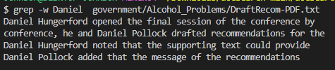
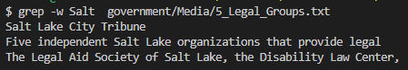
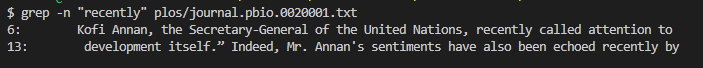
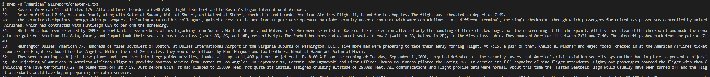
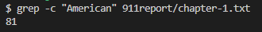
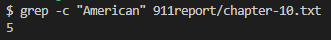
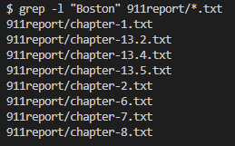
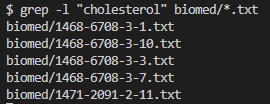

# **Lab Report 3: Grep Command-line Options**
Source used for all: [https://www.geeksforgeeks.org/grep-command-in-unixlinux/#](https://www.geeksforgeeks.org/grep-command-in-unixlinux/#)

## Using -w
`$ grep -w Daniel  government/Alcohol_Problems/DraftRecom-PDF.txt`

In this example, it is looking for the word "Daniel" inside `DraftRecom-PDF.txt` and returning all of the lines it finds the word in.

`$ grep -w Salt  government/Media/5_Legal_Groups.txt`

In this example, it is looking for the word "Salt" inside `5_Legal_Groups.txt` and returning all of the lines it finds the word in.

**What it is doing and why it is useful**

The `-w` option searches for the whole word in each line of the .txt file. This is useful some substrings may have the word in it such as how "service" has the substring "vice" in it, so when you don't have the `-w` and look for "vice" with grep it makes it so that it returns the line with the word "service" in it.

---
## Using -n
`$ grep -n "recently" plos/journal.pbio.0020001.txt`

This example is acting like a normal grep and finding the string "recently" in `journal.pbio.0020001.txt`. However, this time, when it gives us the lines, it shows us which lines it found "American" in. For this one, it found that line 6 and 13 have it.

`$ grep -n "American" 911report/chapter-1.txt`

This example is looking for the string "American" in `chapter-1.txt`. When I did this, the output was very large as it had many many lines, so I could only screenshot a certain number of them. There was a lot of lines (the next command will count them).

**What it is doing and why it is useful**

The `-n` option is like a normal grep but adds the line numbers of where it found the specifc line. This is useful because you might want to look for a specific string or word being used and reading the content surrounding the word such as when a specific name is mentioned.

---
## Using -c
`$ grep -c "American" 911report/chapter-1.txt`

Connecting it back to the last grep with "American" and using `-n `, the output was very big and had a lot of lines. Now, by using `-c`, we can count how many lines had it. For this one, it has 81 lines that has the string "American" in it.

`$ grep -c "American" 911report/chapter-10.txt`

This example shows that `chapter-10.txt` has 5 lines with the string "American".

**What it is doing and why it is useful**

The `-c` option makes it so that it returns the number of lines with the specific string. This is useful because in large files with long lines, it would be hard to manually count each line, and with the `-c` it counts it all easily for you.

---
## Using -l
`$ grep -l "Boston" 911report/*.txt`

This example shows all of the txt files that has the string "Boston" in the `911report` directory

`$ grep -l "cholesterol" biomed/*.txt`

This example shows all of the txt files that has the string "cholesterol" in the `biomed` directory.

**What it is doing and why it is useful**

The `-l` option makes it so that it returns the file names with the specific string you want to search for. This is very useful because if you have many text files and want are looking for a specific string in them, you can just use `-l` to narrow it down to the files that actually have the string.
