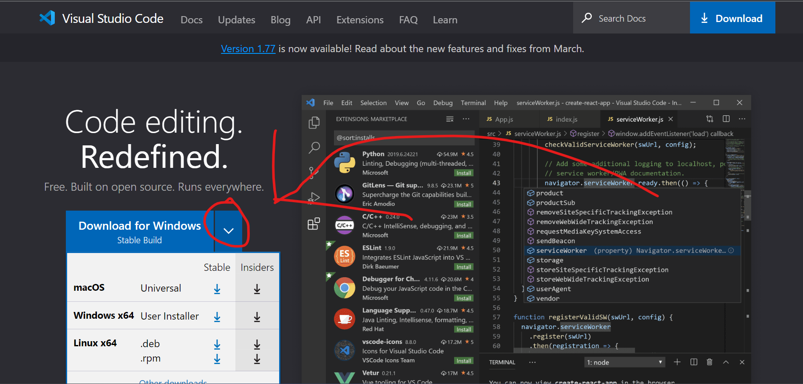
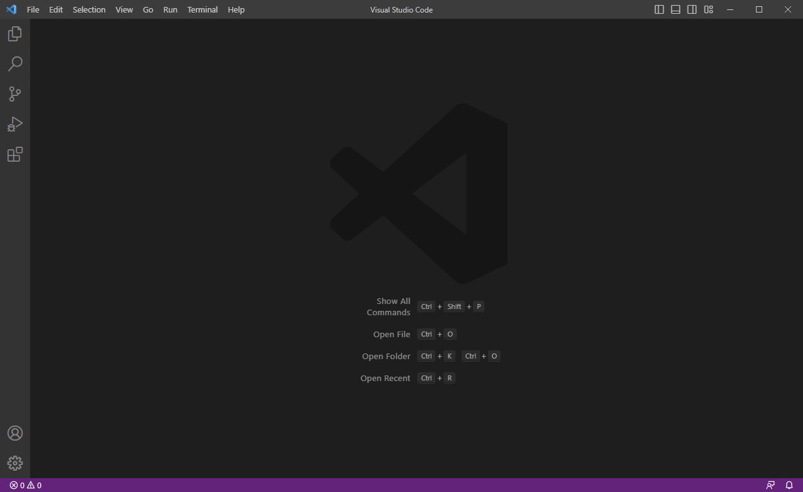
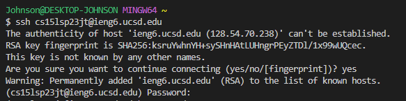
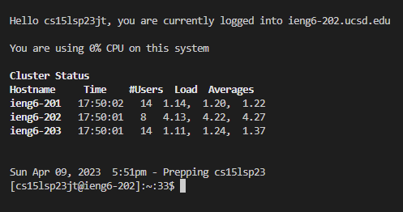
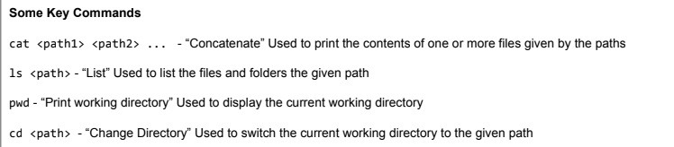
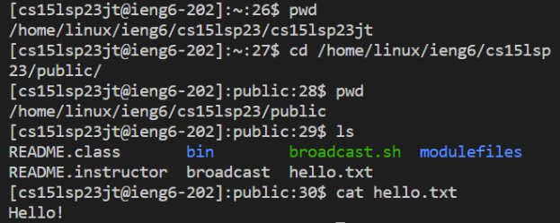

# **How to Remote Access CSE 15L**

## Installing VSCode
1. Go onto the [VSCode](https://code.visualstudio.com/) website -  [https://code.visualstudio.com/](https://code.visualstudio.com/)
2. Click on the drop down and download [VSCode](https://code.visualstudio.com/) installer for your OS

3. Run the installer and follow the intructions on it

- After you are done you should see a screen that looks similar to this

## Remotely Connecting
1. Look up your course-specific account for CSE15L using this link: 
  - [https://sdacs.ucsd.edu/~icc/index.php](https://sdacs.ucsd.edu/~icc/index.php)
    - If it is your first time accessing this account, you need to reset your password to set a password
    - If you are having trouble, here are the [instructions to reset your CSE15L password](https://drive.google.com/file/d/17IDZn8Qq7Q0RkYMxdiIR0o6HJ3B5YqSW/view)
  - The course specific account should look something like **cs15lsp23--@ieng6.ucsd.edu** with the -- being some letters for your course-specific account
> *save your account and password as we will need it soon*
2. Download [git](https://gitforwindows.org/) for windows and follow the instructions
  - If you are on mac, [git](https://gitforwindows.org/) should already be installed
3. Use git bash as the default terminal in VS Code by following the instructions below
  - [How to use Bash in VScode](https://stackoverflow.com/questions/42606837/how-do-i-use-bash-on-windows-from-the-visual-studio-code-integrated-terminal/50527994#50527994)
4. Open terminal in VScode
5. In the terminal, use the following command with your course-specific account:
- `$ ssh cs15lsp23--@ieng6.ucsd.edu`
- Remember that the `--` is the letters for your account and that you do not include the `$`
  - If it is your first time you will probbaly get a message similar to this, so type `yes` and then enter

- Once you've done that it will now ask for your password, so type the password you created for your course-specific account
> The password might not look like it is being typed, but it is, so keep trying.

> If you keep running into trouble and you are sure that you typed in your password correctly, it could be that your password for your course-specific account ahs not updated and you need to wait.
6. Once logged in, you will see a message similar to this:

Congratulations! Your terminal is now connected to a computer in the CSE basement
## Trying Some Commands
Now that you are connected, try running some code

More you can try out:
- `ls /home/linux/ieng6/cs15lsp23/cs15lsp23--` with `--` being one of your group member's username
- `cp /home/linux/ieng6/cs15lsp23/public/hello.txt ~/`
- `cat /home/linux/ieng6/cs15lsp23/public/hello.txt`
- `ls -lat`

As an example, here are some commands that I used together:

> Source: Week 1 Worksheet on Thursday

To log out of the remote server in your terminal, you can do
- Ctrl + D
- Run the commmand `exit`
