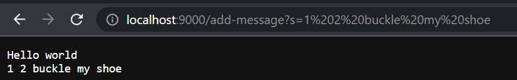

# **Lab Report 2 - Servers and Bugs (Week 3)**

## Part 1
Code for `StringServer.java`:

- The methods in the code that were called are 

## Part 2

## Part 3
Something that I learned in week 2 was how to use Github Desktop and the different uses for it. I did not know that GitHub had a feature like this. Because of this, it allows me to work on the lap reports I put on the GitHub from my laptop and desktop at home without having to transfer over files since it is all saved in my GitHub repository. After this class, I can see myself using this a lot.
