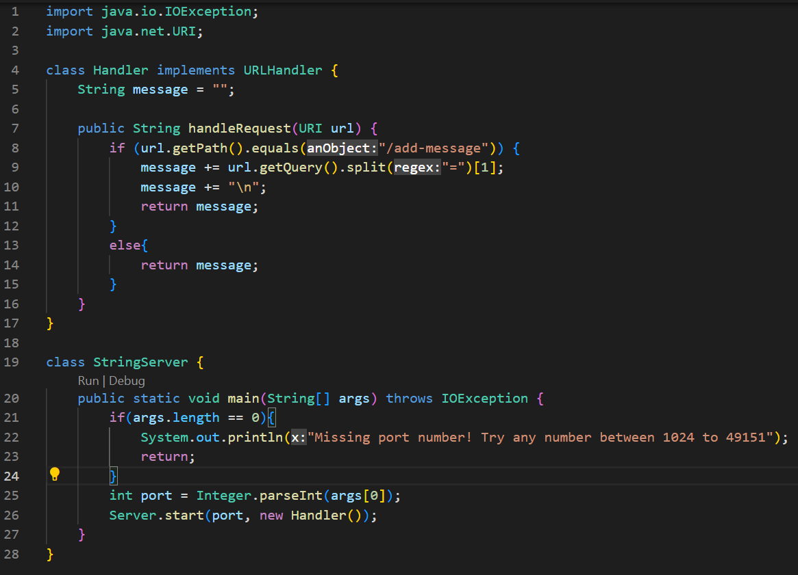
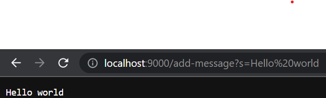

# **Lab Report 2 - Servers and Bugs (Week 3)**

## Part 1
Code for `StringServer.java`:



- The methods in the code that were called are `getPath()` and the string method `equals()` to make it so that the path was `"/add-message"` and then `getQuery()` in combination with the string method `split()` to see what the string we want to add is.
- For `getPath()` and `getQuery()`, they do not need an argument. However, for them to work, we need a `URI` type on the left such as `something.getPath()`. For the `equals()`, the valid argument is a `String` and it makes sure that the `String` on the left is the same as the `String` in the argument. Lastly, for the `split()` method, the valid arguments it takes are `String`s. The most relevant field is `message` and it is a `String` type.
- Some of the `URI` gets changed to `String` by the methods. Methods such as `getQuery()` have a `URI` on the left and then returns a `String` type. 


## Part 2
The method I used for this part was reverseInPlace in the `ArrayExamples.java` and tested in `ArrayTests.java`

Failure-inducing input for buggy program
```
@Test 
public void testReverseInPlaceManyInts() {
  int[] input1 = {0,1,2,3,4,5};
  ArrayExamples.reverseInPlace(input1);
  assertArrayEquals(new int[]{5,4,3,2,1,0}, input1);
}
```

Input that doesn't induce a failure
```
@Test 
public void testReverseInPlace() {
  int[] input1 = {99};
  ArrayExamples.reverseInPlace(input1);
  assertArrayEquals(new int[]{99}, input1);
}
```
Symptom


Bug before:
```
static void reverseInPlace(int[] arr) {
  for(int i = 0; i < arr.length; i += 1) {
    arr[i] = arr[arr.length - i - 1];
  }
}
```
Bug Fixed:
```
static void reverseInPlace(int[] arr) {
  int temp;
  for(int i = 0; i < arr.length/2; i += 1) {
    temp = arr[i];
    arr[i] = arr[arr.length - i - 1];
    arr[arr.length - i - 1] = temp;
  }
}
```
This fix addresses the issue because what was happening was that it would loop through the whole thing and and replace the beginning elements with the ones at the end, but once it got to the middle, it didn't have those beginning elements anymore. This caused it to replace the second half with the elements from the first half that the loop just changed. The solution to this is to make it to that the loop stops half way through and save the elements insdie temp so that we can replace the elements at the second half. What this basically does is swap the element at index 0 and the index at the end of the array, which by the time it reaches half way though, reverses the list. 


## Part 3
Something that I learned in week 2 was how to use Github Desktop and the different uses for it. I did not know that GitHub had a feature like this. Because of this, it allows me to work on the lap reports I put on the GitHub from my laptop and desktop at home without having to transfer over files since it is all saved in my GitHub repository. After this class, I can see myself using this a lot.
