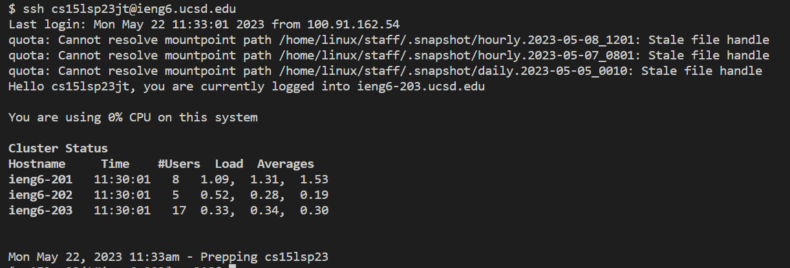
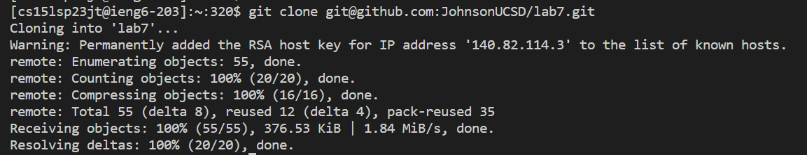
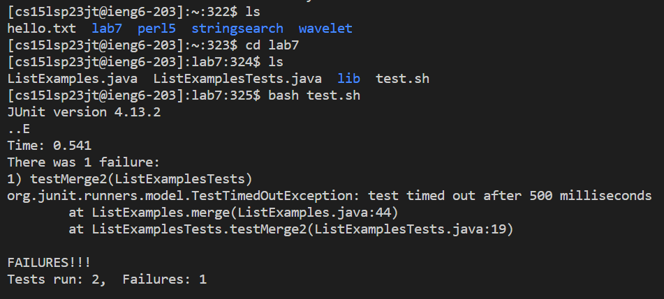
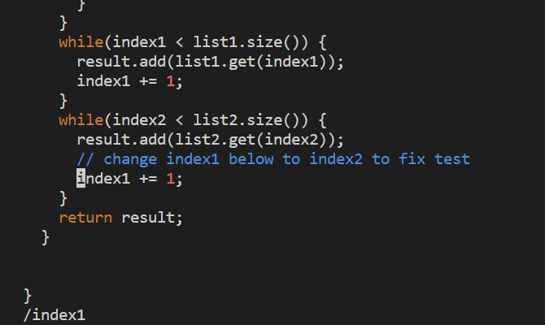
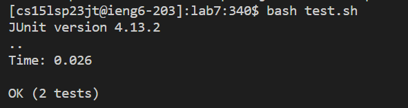
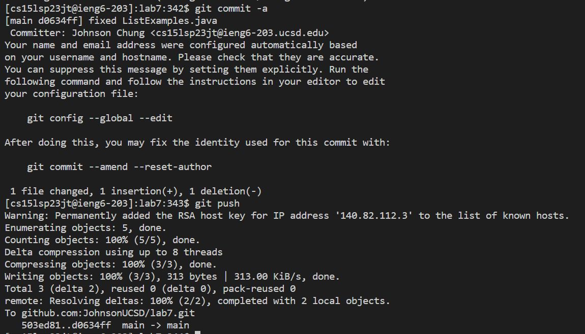

# Lab Report 4

## Step 4 

Keys Pressed: ssh cs15lsp23jt@ieng6.ucsd.edu`<enter>`

I was logging into my CSE 15L remote account.
  
## Step 5

Keys Pressed: git clone `<ctrl + v>`

I am cloning the fork of the repository from your Github account. I copied the link to the ssh from the repository on my clipboard.

## Step 6

Keys Pressed: ls`<enter>`
              cd lab7`<enter>`
              ls`<enter>`
              bash test.sh`<enter>`

I am navigating through my directory by using `ls` to see where I am and where I need to go. I used `cd` to get into `lab7` directory then I ran the test using the `test.sh` with bash. When I run the test, it failed.

## Step 7

Keys Pressed: vim L`<tab>`.j`<tab>``<enter>`
              /index1`<enter>`
              nnnnnnnnni`<right>``<right>``<right>``<right>``<right>``<right>``<backspace>`2`<esc>`:wq`<enter>`
              
I use `vim` to access the file. The `<tab>`s autofill the `ListExamples.java` because that is what I am trying to fix. To look for the index1 I need to change, I do `/index1` to look for strings that have "index1" and then enter to start going through them. Pressing "n" makes it go to the next instance where there is "index1", so I keep doing this until I see the comment that says to change index1 to index2. After I am on the "index1" that I need to change to "index2", I go into insert mode and go to the end of the word, delete the 1, and then add a 2. After that, `<esc>` exits insert mode and `:wq` saves the changes and quits.

## Step 8

Keys Pressed: bash test.sh`<enter>`

I used the used bash and the `.sh` test file to run the test on `ListExamples.java` again and this time, it succeeded.

## Step 9

Keys Pressed: git commit -a`<enter>`
              ifixed ListExamples.java`<esc>`
              git push`<enter>`

I committed the any changes I've made using `git commit -a`. After that, it brought me to a place to write the commit message. To start writing, I had to go into insert mode so I pressed "i", and then my message was "fixed ListExamples.java". After that, I pressed `<esc>` to exit insert mode and then git push to push the commit changes.

