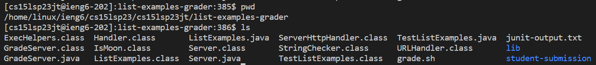
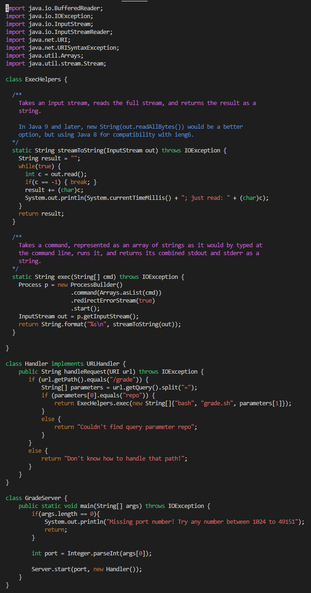
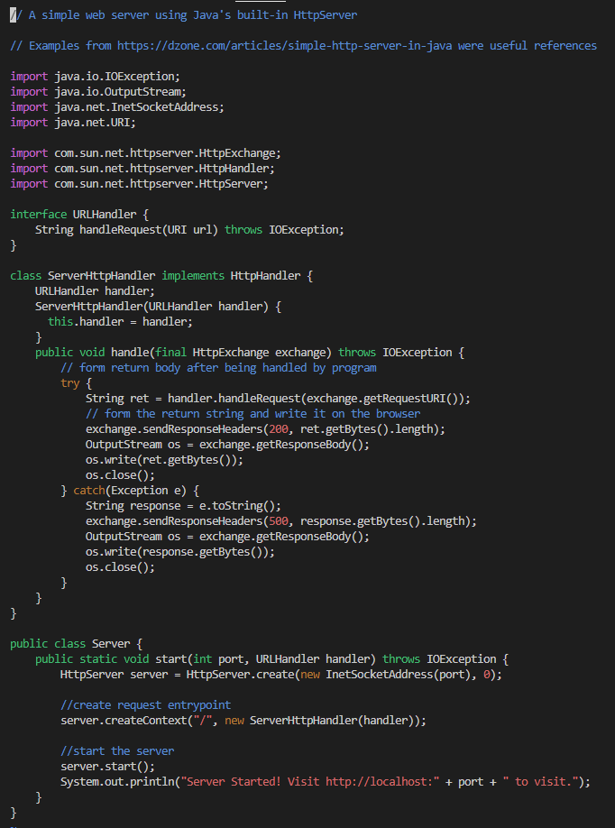
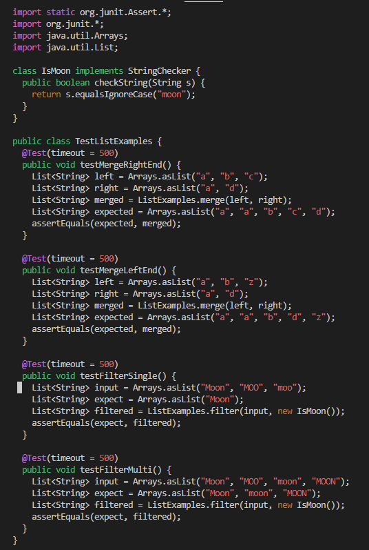
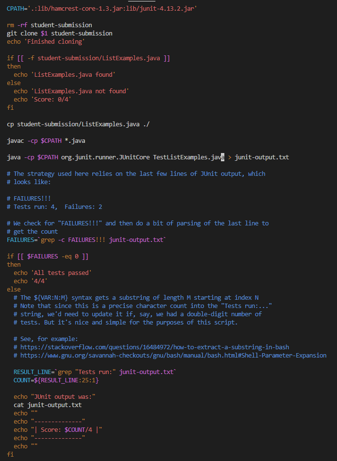

# Lab Report 5

## Part 1 – Debugging Scenario

**Original Edstem Post from Student**

Response from TA:

1. Right under the `initializationError`, it talks about how it can't find the `TestListExamples.java` class. When running your code in the command line, you only include the `.java` for `javac` to compile the file, and with the `java` command you only need to class name. So, in `grade.sh`, try removing the `.java` on the line you used to run the JUnit test starting with `java -cp`.

2.

The bug was that in the `.sh` file, after compiling the `TestListExamples.java`, to run it, I used `TestListExamples.java`. Instead, what it should've been is `TestListExamples`. Because I wrote `TestListExamples.java`, it tried to look for it as one of the `.class` files, but it didn't exist after compiling `TestListExamples.java` because the what it created when compiling is `TestListExamples.class`, and to run it we only need `TestListExamples`.

3. I did this all using the CSE 15L remote server so I don't have access to things such as the left side and am using vim to access the files.

**The File and Directory Structure**

**Contents of each file before fixing bug**

GradeServer.java

Server.java

TestListExamples.java

grade.sh

**The full command line ran to trigger the bug**

**Description of what to edit to fix the bug**

To fix the bug, I had to delete the `.java` in `TestListExamples.java` on this line: `java -cp $CPATH org.junit.runner.JUnitCore TestListExamples.java > junit-output.txt` 

---

## Part 2 - Reflection
Something that I leanred in the second half of this quarter that I didn't know before is using vim. Before I knew about vim, I didn't know that you could edit a file on the command line. Editing is can feel very clunky at times, but having the ability to do so is very useful. Without having the files on your computer, you can just remote onto a server and edit files, view them, and samve them, which is pretty cool. 
