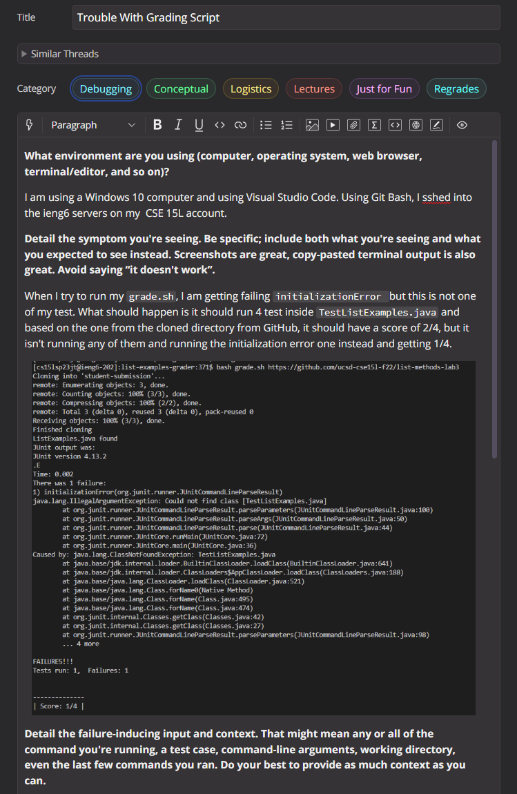
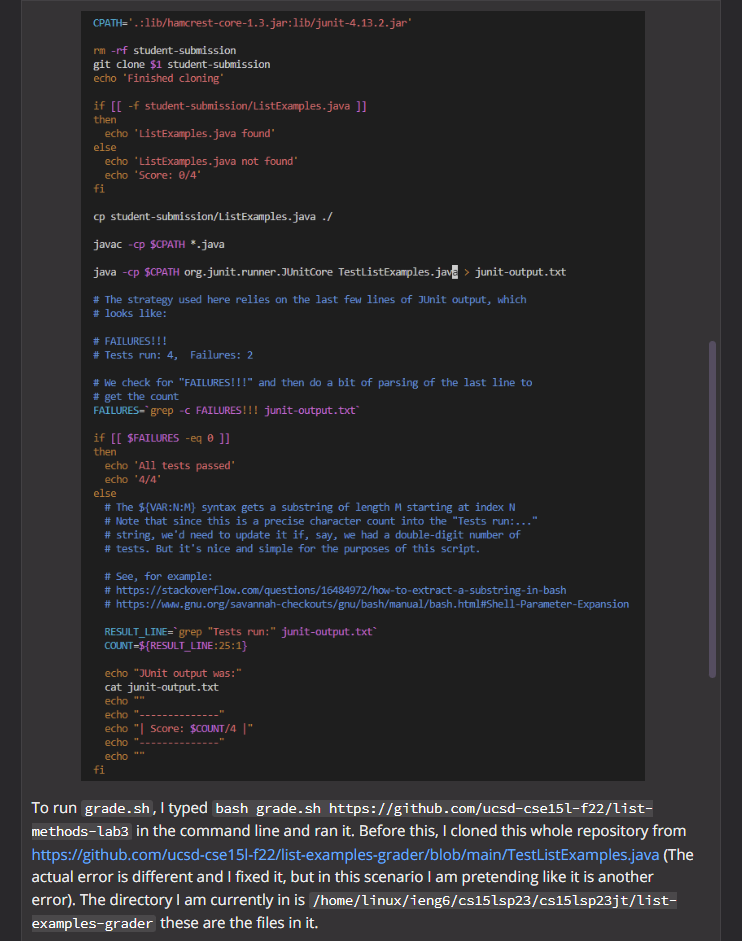
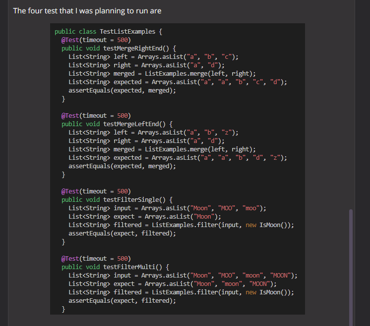
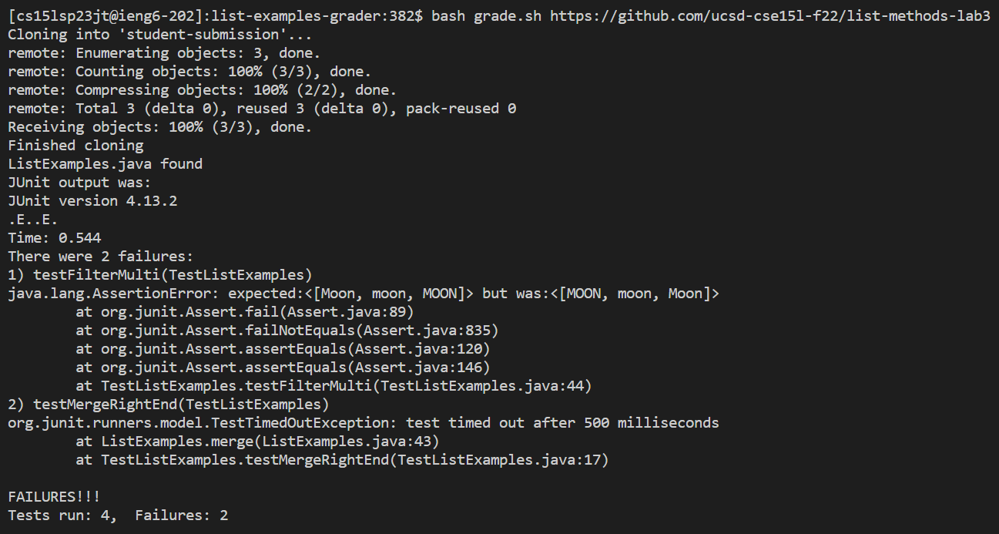

# Lab Report 5

## Part 1 – Debugging Scenario

**Original Edstem Post from Student**

Response from TA:

1. Right under the `initializationError`, it talks about how it can't find the `TestListExamples.java` class. When running your code in the command line, you only include the `.java` for `javac` to compile the file, and with the `java` command you only need to class name. So, in `grade.sh`, try removing the `.java` on the line you used to run the JUnit test starting with `java -cp`.

2.

The bug was that in the `.sh` file, after compiling the `TestListExamples.java`, to run it, I used `TestListExamples.java`. Instead, what it should've been is `TestListExamples`. Because I wrote `TestListExamples.java`, it tried to look for it as one of the `.class` files, but it didn't exist after compiling `TestListExamples.java` because the what it created when compiling is `TestListExamples.class`, and to run it we only need `TestListExamples`
.

What environment are you using (computer, operating system, web browser, terminal/editor, and so on)?

I am using a Windows 10 computer and using Visual Studio Code. Using Git Bash, I sshed into the ieng6 servers on my  CSE 15L account. 

Detail the symptom you're seeing. Be specific; include both what you're seeing and what you expected to see instead. Screenshots are great, copy-pasted terminal output is also great. Avoid saying “it doesn't work”.

When I try to run my grade.sh, I am getting failing initializationError but this is not one of my test. What should happen is it should run 4 test inside TestListExamples.java and based on the one from the cloned directory from GitHub, it should have a score of 2/4, but it isn't running any of them and running the initialization error one instead and getting 1/4.

Detail the failure-inducing input and context. That might mean any or all of the command you're running, a test case, command-line arguments, working directory, even the last few commands you ran. Do your best to provide as much context as you can.

To run grade.sh, I typed bash grade.sh https://github.com/ucsd-cse15l-f22/list-methods-lab3 in the command line and ran it. Before this, I cloned this whole repository from https://github.com/ucsd-cse15l-f22/list-examples-grader/blob/main/TestListExamples.java (The actual error is different and I fixed it, but in this scenario I am pretending like it is another error). The directory I am currently in is /home/linux/ieng6/cs15lsp23/cs15lsp23jt/list-examples-grader these are the files in it.

The four test that I was planning to run are 

